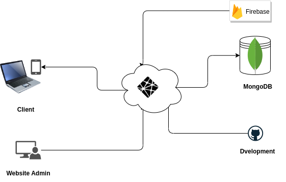

Here is a sample README.md file you can use for your E-commerce application:

Full Stack E-commerce Application
======================

This is an E-commerce application built with Node.js, Express, and MongoDB on the server-side, and React on the client-side. The application allows users to shop online, add products to their cart, and pay using the Stripe payment gateway.




The application consists of three main parts:

1.  `api`: This is the server-side part of the application built with Node.js and Express. It connects to MongoDB using Mongoose, and handles all the requests from the client-side.
    
2.  `client`: This is the client-side part of the application built with React. It provides a user-friendly interface for users to shop online, add products to their cart, and pay using the Stripe payment gateway.
    
3.  `admin`: This is the dashboard for the admin to manage the products and orders. The admin can add, remove, and view all the operations performed in the application.
    

The images of the products are stored in Firebase, and the application connects to it to retrieve the images.
```
                            +----------+       +-------------+       +--------------+
                            |   API    |------>|   MongoDB   |<------|   Firebase   |
                            +----------+       +-------------+       +--------------+
                                 ^                    |                     ^
                                 |                    |                     |
                                 |                    |                     |
                                 |                    |                     |
                                 |                    |                     |
+--------+        +----------+   |   +------------+  |  +------------+   |   +--------+
| Client |<------>|   API    |<--+-->| Stripe API |<-+->|  Admin UI  |<--+-->| Server |
+--------+        +----------+       +------------+    +------------+       +--------+
```


In this block diagram, there are five main components:

1.  `Client`: The client-side part of the application built with React. It communicates with the API to perform actions such as adding products to the cart and making payments.
    
2.  `API`: The server-side part of the application built with Node.js and Express. It handles all the requests from the client-side and communicates with MongoDB and Firebase to retrieve and store data.
    
3.  `MongoDB`: The database used to store the products, users, and orders.
    
4.  `Firebase`: The storage used to store the images of the products.
    
5.  `Admin UI`: The dashboard for the admin to manage the products and orders. It communicates with the API to perform actions such as adding and removing products, and viewing all the operations performed in the application.
    

Note that the API also communicates with the Stripe API to process payments.

License
-------

This project is licensed under the MIT License - see the LICENSE file for details.

